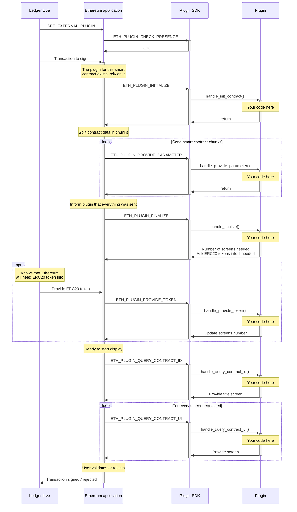

This diagram showcases a complete sequence of the parsing, display, and signature of a smart contract.

```mermaid
sequenceDiagram
    participant L as Ledger Live
    participant E as Ethereum application
    participant SDK as Plugin SDK
    participant P as Plugin
    L->>E: SET_EXTERNAL_PLUGIN
    E->>+SDK: ETH_PLUGIN_CHECK_PRESENCE
    SDK->>-E: ack;
    L->>+E: Transaction to sign
    Note over E: The plugin for this smart<br/>contract exists, rely on it
    E->>+SDK: ETH_PLUGIN_INITIALIZE
    SDK->>+P: handle_init_contract()
    Note over P: Your code here
    P->>-SDK: return;
    SDK->>-E: ;
    Note over E: Split contract data in chunks
    loop Send smart contract chunks
        E->>+SDK: ETH_PLUGIN_PROVIDE_PARAMETER
        SDK->>+P: handle_provide_parameter()
        Note over P: Your code here
        P->>-SDK: return;
        SDK->>-E: ;
    end
    Note over E: Inform plugin that everything was sent
    E->>+SDK: ETH_PLUGIN_FINALIZE
    SDK->>+P: handle_finalize()
    Note over P: Your code here
    P->>-SDK: Number of screens needed<br/>Ask ERC20 tokens info if needed
    SDK->>-E: ;
    opt
        Note over L: Knows that Ethereum<br/>will need ERC20 token info
        L->>E: Provide ERC20 token
        E->>+SDK: ETH_PLUGIN_PROVIDE_TOKEN
        SDK->>+P: handle_provide_token()
        Note over P: Your code here
        P->>-SDK: Update screens number
        SDK->>-E: ;
    end
    Note over E: Ready to start display
    E->>+SDK: ETH_PLUGIN_QUERY_CONTRACT_ID
    SDK->>+P: handle_query_contract_id()
    Note over P: Your code here
    P->>-SDK: Provide title screen
    SDK->>-E: ;
    loop For every screen requested
        E->>+SDK: ETH_PLUGIN_QUERY_CONTRACT_UI
        SDK->>+P: handle_query_contract_ui()
        Note over P: Your code here
        P->>-SDK: Provide screen
        SDK->>-E: ;
    end
    Note over E: User validates or rejects
    E->>-L: Transaction signed / rejected
```
