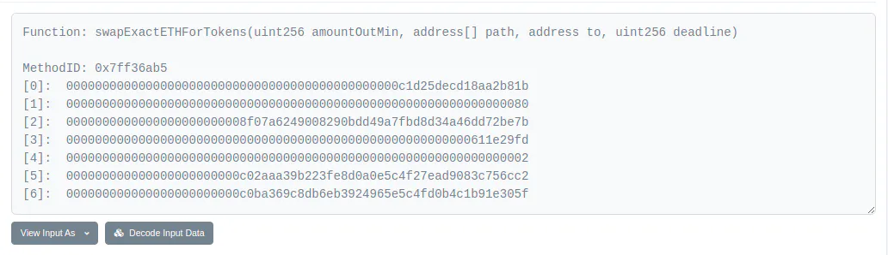

This page will walk you through developing your plugin, from the Boilerplate fork to the functional tests.<br/>
Sections of the template code you can edit are commented with a `EDIT THIS` marker.

## Change the plugin metadata

In the `Makefile` you will need to change the following elements:

- `APPNAME` to suit your plugin name (e.g., Paraswap, 1inch, Lido)
- `APPVERSION` for your plugin version

## Change the plugin icons

In the `icons/` and `glyphs/` directory, rename the images to include your `APPNAME` instead of the `pluginboilerplate` name.<br/>
Change the picture provided to use one suitable for your plugin.<br/>
Don't forget to refer to the [documentation](https://developers.ledger.com/docs/device-app/deliver/deliverables/icons#device-icon).<br/>
Incompatible icons will be detected by the CI.

## Change the selectors

Let’s go to the first `EDIT THIS` comment in `app-plugin-boilerplate/src/plugin.h`. In this file you can list all the selectors for each contract. The template uses uses two selectors but you are not limited. <br/>
Enter your selectors here, in the format X(NAME, value).

### Example: Let's support `SwapExactEthForToken` from Uniswap V2

You can find it using Etherscan, and you can also compose it using the ABI (Application Binary Interface).

By looking at [recent transactions on Uniswap](https://etherscan.io/txs?a=0x7a250d5630b4cf539739df2c5dacb4c659f2488d), we find a transaction with the `SwapExactEthForToken` method. Here is [an example](https://etherscan.io/tx/0x216bfa6fb8488901d168810cda1b716d1abcb002a87c3224180deaff00c950fc).

Let's scroll down and click on "Click to see more", to read:



The header line shows `Method ID` to be `0x7ff36ab5`.
This is going to be the 4 bytes of `SWAP_EXACT_ETH_FOR_TOKENS_SELECTOR`:

```c
#define SELECTORS_LIST(X)                    \
    X(SWAP_EXACT_ETH_FOR_TOKENS_SELECTOR, 0x7ff36ab5)
```

## Update the `PLUGIN_SPECIFICATION.md` file

Please update the `PLUGIN_SPECIFICATION.md` file at the root of the project to include your smart contract and selectors.

## Adapt the handlers

Now we have to change each handler to parse and display your smart contract.

We advise you to stick to the file structure done in plugin-boilerplate and keep each handler in a dedicated file.

Please look at the [sequence diagram](../technical_informations/diagram.md) to better understand at which step each handler is called.
